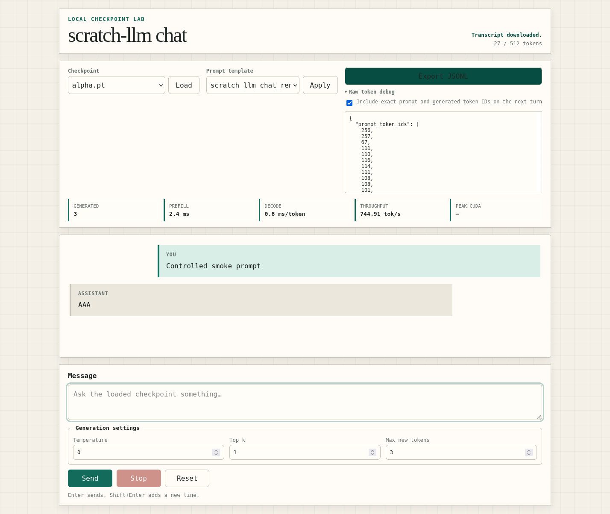
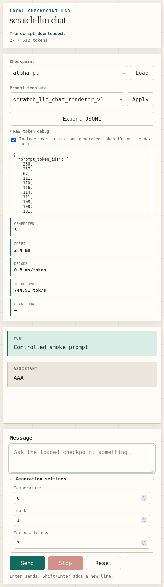

# gpt-training-sandbox

A from-scratch PyTorch sandbox for pretraining, supervised finetuning, evaluating, and post-training small GPT-style chat models.

The repository is being built in small vertical slices. The byte tokenizer,
tiny decoder-only GPT, typed configuration, run layout, and local metrics
foundations are present. Tiny-text and production pretraining,
checkpoint-backed sampling, bounded tokenizer/base evaluation, and supervised
finetuning are executable; the remaining chat commands have stable interfaces
whose non-dry-run implementations land in later slices.

## Roadmap status

Milestone 1 — Hello Tiny GPT: complete. The first vertical slice runs local
text through the byte tokenizer and tiny decoder-only GPT, trains to a
checkpoint with decreasing loss and local JSONL metrics, samples non-empty
text from that checkpoint, and resumes training from a saved step.

Run its bounded CPU command-level acceptance check with:

```bash
uv run --extra dev pytest -q tests/test_pretrain_integration.py
```

The full test suite also protects the deterministic fixed-batch overfit
threshold.

Milestone 2 — Tracking Foundation: complete. Tracker, JSONL, optional W&B, and
composite backends share one interface. Every config-driven command resolves
YAML, supported W&B environment variables, dotted overrides, and dedicated
tracking flags through one path, then creates an always-local JSONL stream and
atomic run summary. The executable pretraining path receives the same tracker
used by command dry runs, while the base install remains fully functional
without W&B.

Run its bounded, credential-free CPU acceptance check with:

```bash
uv run --extra dev pytest -q \
  tests/test_tracking.py \
  tests/test_config_loading.py \
  tests/test_scripts.py \
  tests/test_pretrain_integration.py
```

## Setup

Install [uv](https://docs.astral.sh/uv/), clone the repository, and create the
locked development environment:

```bash
uv sync --extra dev
```

The core install deliberately excludes W&B and web/demo frameworks. Install an
optional group only when working on it, for example `uv sync --extra tracking`
or `uv sync --extra web`. GPT-2 and cl100k tokenizer comparisons are also
optional:

```bash
uv sync --extra tokenizer-comparison
```

Every command's `--help` path and the default tokenizer evaluation work with
the core dependencies alone.

Ruff is pinned in the development extra because formatter output is
version-dependent. Update that pin and `uv.lock` together when intentionally
adopting a new formatter version.

## Local web chat

Install the optional server dependencies and launch a supervised-finetuning
checkpoint on the loopback-only default:

```bash
uv sync --extra web
uv run --extra web python -m scripts.web_chat \
  --checkpoint runs/my-sft-run/checkpoints/final.pt \
  --device cpu
```

Open `http://127.0.0.1:8000`. The initial checkpoint must be a compatible SFT
checkpoint. Other `.pt` checkpoints in the same directory appear in the local
checkpoint selector and are validated before replacing the active session.
The page can switch the server-owned prompt template, adjust temperature, top
k, and maximum new tokens, stream or stop a response, reset the conversation,
show per-turn latency/throughput and context usage, and expose exact token IDs
only when Raw token debug is explicitly enabled.

The server has no authentication or TLS. It binds only to `127.0.0.1` by
default; do not expose it to an untrusted network. A non-loopback bind is
rejected unless you acknowledge the exposure with `--allow-remote-bind`, for
example `--host 0.0.0.0 --allow-remote-bind`.

Chat content stays in the in-memory local session. Export JSONL downloads only
the completed conversation using the fixed
`scratch-llm-transcript.jsonl` filename; stopped and failed turns are rolled
back. Ordinary web inspection metrics contain counts, timings, opaque IDs, and
checkpoint metadata—not raw prompts or responses. Raw token debug is local,
explicit, and visible in the page, so treat it and exported transcripts as
potentially sensitive files.

The terminal and web chat commands do not create tracking output unless an
optional `--config` (or another tracking config override) is supplied. With a
config, completed-turn counts, timing, and opaque run/session/turn IDs go to the
always-local JSONL tracker and any enabled W&B backend. Raw content remains off
by default. The existing `tracking.wandb.log_prompts` and
`tracking.wandb.log_responses` gates apply independently to every tracker
backend despite their historical config nesting:

```bash
uv run python -m scripts.chat \
  --checkpoint runs/my-sft-run/checkpoints/final.pt \
  --config configs/smoke.yaml \
  --override run.name=local-chat-observation \
  --override tracking.wandb.log_prompts=true \
  --override tracking.wandb.log_responses=false \
  --no-wandb
```

Enabling either raw-content gate prints a privacy warning before the session.
Each tracked record contains only the current completed turn; resets rotate the
session identity, while cancelled, failed, and partial turns emit no content.
Explicit terminal or browser transcript export is separate and continues to
contain the complete committed conversation regardless of tracking policy.

The controlled fixture is shown at desktop and narrow widths:





Run the complete credential-free, CPU-only browser smoke with locally installed
Firefox and geckodriver:

```bash
uv sync --extra dev --extra web
uv run --extra dev --extra web python -m scripts.web_smoke \
  --artifacts-dir runs/web-smoke \
  --screenshots-dir docs/images
```

The command starts the actual web command on an ephemeral `127.0.0.1` port,
uses two deterministic tiny checkpoints, audits browser traffic through a
rejecting loopback proxy, validates streaming/metrics/stop/reset/settings/
checkpoint/debug/export behavior, and shuts down the server process group.
Logs, the validated JSONL response, and failure diagnostics remain in
`runs/web-smoke/`; the screenshots above are regenerated from the same
synthetic messages and contain no user data or credentials.

The plain FastAPI/JavaScript client is the required and primary educational web
harness. The optional Gradio adapter and checkpoint-comparison surface are
deferred beyond Milestone 7: the former currently duplicates maintained UI
behavior, while the latter needs a reproducible one-RTX-3090 execution design.
The rationale, ownership, and post-milestone constraints are recorded in the
[optional web extension decisions](docs/decisions/optional-web-extensions.md).

The focused FastAPI and browser acceptance suite is:

```bash
uv run --extra dev --extra web pytest -q \
  tests/test_web_app.py \
  tests/test_web_session_api.py \
  tests/test_websocket_api.py \
  tests/test_web_inspection.py \
  tests/test_web_frontend.py \
  tests/test_web_chat_cli.py \
  tests/test_chat_adapter_architecture.py \
  tests/test_web_browser_smoke.py
```

## Tests

Run the full test suite from the repository root:

```bash
uv run --extra dev pytest
```

The repository-wide formatting check is:

```bash
uv run --extra dev ruff format --check .
```

## Partial ClimbMix download

Download a bounded training prefix plus the fixed validation shard with:

```bash
uv run python -m scripts.download_climbmix \
  --num-train-shards 16 \
  --include-val
```

The default destination is `data/parquet/base_data_climbmix/`. Each shard is
streamed through a same-directory `.part` file, resumed only after a compatible
HTTP range response, and atomically published after its declared size is
present. Existing nonempty published shards are skipped. Human progress and
retry state go to stderr; the final stdout line is a JSON object containing
ready/downloaded/skipped shard counts and total bytes.

## Raw ClimbMix statistics

Inspect the same canonical train prefix and fixed validation shard used by data
preparation without loading a full corpus into memory:

```bash
uv run python -m scripts.data_stats \
  --data-dir data/fixtures/parquet \
  --num-train-shards 2 \
  --include-val \
  --output metrics/data_stats.json
```

The human summary distinguishes documents, Unicode characters, and UTF-8
bytes. The JSON report contains immutable split and total fields and is written
atomically. `--doc-cap` counts documents, including empty strings;
`--max-chars` applies an exact per-split character budget and may retain a final
document prefix; and `--doc-cap-chars` truncates each document first. These
aliases match `tokenizer.doc_cap`, `tokenizer.max_chars`, and
`data.doc_cap_chars`, respectively. Supplying any cap marks the report as
bounded. Use `--no-val` to select only training data.

## Regex byte-BPE artifacts

`RegexBPETokenizer.save(path)` publishes the learned tokenizer as one complete
directory containing:

```text
tokenizer.json
merges.json
vocab.json
special_tokens.json
token_bytes.pt
```

`tokenizer.json` is the authoritative
`scratch_llm_regex_byte_bpe` format. Its versioned, canonical merge ranks,
raw-byte vocabulary, and ordered special-token mapping determine the stable
`sha256:` tokenizer identity; corpus counts are retained as non-identity
training metadata. The other JSON files are deterministic redundant views for
inspection and interoperability. Loading validates every redundant value
against the authoritative mapping and rejects unknown versions, missing or
extra files, symlinks, traversal paths, noncontiguous IDs, invalid ranks, and
mismatched raw bytes before constructing a tokenizer.

Saving stages all five files beside the destination and publishes the directory
with one atomic rename. The destination must be absent or empty; a nonempty
directory is never overwritten. `token_bytes.pt` is a CPU tensor with
`torch.int32` dtype and shape `(vocab_size,)`. Ordinary entries are measured
directly with `len(decode_single_token_bytes(id))`, including tokens that are
not valid standalone UTF-8; every special-token entry is exactly zero. Loading
uses Torch's weights-only mode and verifies the tensor against the JSON
vocabulary.

## Optimized regex byte-BPE training

The scalable trainer maintains an incremental index of active adjacent pairs
inside each regex chunk. A lazy heap preserves the reference rule—highest
frequency, then the lexicographically smallest pair—while each merge updates
only its immediate neighbors. The readable full-recount implementation remains
available as an executable specification and fallback.

Run the real one-process CPU training path with the optimized default:

```bash
uv run python -m scripts.train_tokenizer \
  --config configs/smoke.yaml \
  --override run.name=tokenizer-32k \
  --override tokenizer.type=regex_byte_bpe \
  --override tokenizer.vocab_size=32768 \
  --override tokenizer.max_chars=10000000 \
  --override tokenizer.doc_cap=100000 \
  --override model.vocab_size=32768 \
  --override data.profile=nanochat_climbmix \
  --override data.parquet_dir=data/parquet/base_data_climbmix \
  --override data.num_tokenizer_train_shards=8 \
  --override data.doc_cap_chars=10000 \
  --algorithm optimized \
  --no-wandb
```

The requested 32,768 vocabulary includes the nine final special tokens and
therefore learns 32,503 mergeable entries. The bounded corpus must retain
enough adjacent pairs to reach that target; exhaustion is an explicit failure,
never a silently undersized tokenizer. A successful run publishes the same
five canonical files under `artifacts/tokenizer/` and records algorithm,
corpus limits/counts, elapsed time, and Python peak allocations in
`metrics/tokenizer_training.json`.

Capacity depends heavily on chunk diversity and pair frequency. For the first
10-million-character, eight-shard trial, run on one process, budget at least
16 GiB of free system RAM and allow minutes to hours on a modern CPU. Treat
that as a planning envelope rather than a guaranteed ceiling: start with a
smaller `tokenizer.max_chars`, inspect the recorded peak, and scale within the
machine's RAM. Raw parquet rows are streamed, but the bounded token graph and
pair occurrence index remain in memory during training.

Before a large run, compare both implementations on a small common prefix:

```bash
uv run python -m scripts.train_tokenizer \
  --config configs/smoke.yaml \
  --override run.name=tokenizer-trainer-check \
  --override tokenizer.type=regex_byte_bpe \
  --override tokenizer.vocab_size=512 \
  --override model.vocab_size=512 \
  --override data.profile=nanochat_climbmix \
  --override data.parquet_dir=data/parquet/base_data_climbmix \
  --algorithm optimized \
  --benchmark-trainers \
  --benchmark-vocab-size 512 \
  --benchmark-max-documents 64 \
  --benchmark-max-characters 100000
```

`metrics/bpe_training_benchmark.json` records independent monotonic elapsed
time and `tracemalloc` peak memory for `--algorithm reference` and
`--algorithm optimized`, plus exact artifact-semantic equivalence. It does not
enforce a flaky wall-clock ratio. Use `--algorithm reference` directly only
for small debugging runs. Character/document caps and per-document truncation
are shared by both paths. Training failures publish no tokenizer artifact set;
artifact installation itself remains staged and atomic, so interruption cannot
leave a valid-looking partial tokenizer.

## Rank-driven regex byte-BPE encoding

`RegexBPETokenizer` retains the from-scratch Python runtime while avoiding a
full scan of every learned merge for every regex chunk. It builds one
pair-to-rank lookup when the tokenizer is constructed, indexes only adjacent
pairs that actually occur in each chunk, and keeps those candidates in a lazy
rank heap over a linked node list. Applying a merge updates only its immediate
left and right neighborhoods. Equal-rank overlaps retain deterministic
left-to-right behavior.

The clear `merge_pair` composition remains the executable test oracle, and
randomized Unicode differential tests require the rank-driven path to emit
identical IDs. Runtime encoding does not import `tiktoken`; that dependency
remains optional and evaluation-only.

On the first 10-million-character, 32,768-vocabulary ClimbMix tokenizer, the
bounded 140,592-byte evaluation used one warmup and three timed iterations:

| Python encoding path | Encode tokens/sec | Timed token IDs | Seconds |
| --- | ---: | ---: | ---: |
| Full merge-rank sweep | 21.212 | 89,442 | 4,216.626 |
| Active-pair rank heap | 253,578.432 | 89,442 | 0.353 |

The token count remained 29,814, bytes/token remained 4.716, and every
round-trip passed. Throughput is machine-dependent; the deterministic
regression instead proves that irrelevant vocabulary merges do not trigger
full chunk scans.

## Tokenizer evaluation

Evaluate a saved regex byte-BPE tokenizer on five fixed local categories plus
bounded ClimbMix training and fixed-validation samples:

```bash
uv run python -m scripts.eval_tokenizer \
  --config configs/smoke.yaml \
  --override run.name=tokenizer-eval \
  --override tokenizer.type=regex_byte_bpe \
  --override tokenizer.vocab_size=32768 \
  --override model.vocab_size=32768 \
  --override data.parquet_dir=data/parquet/base_data_climbmix \
  --tokenizer-artifacts runs/tokenizer/artifacts/tokenizer \
  --max-documents 32 \
  --max-characters 100000 \
  --document-char-cap 10000
```

The immutable result records the exact data directory, selected shards,
document counts, and character/document limits for every source. It writes
deterministic, atomically replaced `metrics/tokenizer_eval.json` and
`metrics/tokenizer_eval.md` reports from that same result. Both include
vocabulary size, UTF-8 bytes, token counts, bytes per token, round-trip status,
and aggregate encode/decode throughput.

`train_tokenizer` runs this bounded evaluation immediately after publishing
the trained tokenizer. Tune that work independently with
`--eval-max-documents`, `--eval-max-characters`, `--eval-batch-size`,
`--eval-benchmark-warmup`, and `--eval-benchmark-iterations`; use
`--eval-compare` only when the optional comparison dependency is installed.

The benchmark performs explicit warmup iterations, uses a monotonic clock, and
divides by the number of token IDs processed during timed calls. Adjust the
bounded work with `--benchmark-warmup` and `--benchmark-iterations`; reports
record both values and measured seconds.

GPT-2 and GPT-4/cl100k token-count comparisons are opt-in:

```bash
uv run --extra tokenizer-comparison python -m scripts.eval_tokenizer \
  --config configs/smoke.yaml \
  --override run.name=tokenizer-eval-with-comparisons \
  --override tokenizer.type=regex_byte_bpe \
  --override tokenizer.vocab_size=32768 \
  --override model.vocab_size=32768 \
  --override data.parquet_dir=data/parquet/base_data_climbmix \
  --tokenizer-artifacts runs/tokenizer/artifacts/tokenizer \
  --compare
```

Without `--compare`, both baselines are marked skipped and `tiktoken` is never
imported. If comparison is requested without the optional dependency, the
local evaluation still succeeds and marks both baselines unavailable.

## Tracked tokenizer outputs

A successful tokenizer-training run appends one local JSONL metrics event with
the exact roadmap names:

```text
tokenizer/vocab_size
tokenizer/max_chars
tokenizer/doc_cap
tokenizer/num_docs
tokenizer/num_chars
tokenizer/train_seconds
tokenizer/bytes_per_token
tokenizer/encode_tokens_per_sec
tokenizer/decode_tokens_per_sec
```

The first six values come from the completed training result. Compression and
throughput are forwarded directly from the immutable post-training evaluation
result, so reporting does not maintain a second tokenizer calculation.
Standalone `eval_tokenizer` runs similarly forward bytes, tokens, compression,
round-trip status, optional GPT-2/GPT-4 comparison values, and throughput.

Only after every required file is durably present, training registers these
stable run-relative artifacts with type `tokenizer`:

```text
artifacts/tokenizer/tokenizer.json
artifacts/tokenizer/merges.json
artifacts/tokenizer/vocab.json
artifacts/tokenizer/special_tokens.json
artifacts/tokenizer/token_bytes.pt
metrics/tokenizer_eval.json
```

The files and their artifact metadata always remain local. Setting
`tracking.wandb.log_tokenizer_artifacts: false` suppresses only their W&B
uploads; it does not remove the files or their JSONL records. Tokenizer metrics
continue to reach W&B when the remote backend is enabled.

## Tracked data preparation

`prepare_tracked_tokenized_parquet_shards` joins the raw-statistics and
tokenized-shard contracts at their durable publication boundary. It writes the
large `.bin` payloads only to the configured local tokenized-data directory,
then emits one coherent metrics record with the nine roadmap `data/*` names.
Only `artifacts/data_stats.json` and
`artifacts/tokenized_shard_manifest.json` are registered with the run tracker;
raw parquet, raw text, and tokenized payloads are never registered.

Those artifact paths stay relative to the run directory in local JSONL.
Optional W&B uploads resolve them against that run directory and occur only
when `tracking.wandb.log_dataset_artifacts` is true. The local JSONL records are
identical whether the W&B gate is on or off. A validated private completion
record preserves the original shard-write duration and identifies each
tracking event, so retrying a completed or partially logged preparation reuses
the durable shards and does not append duplicate or contradictory totals.

## Smoke dry-run

Resolve the CPU-safe smoke configuration and prepare its run paths without
starting training:

```bash
uv run python -m scripts.pretrain --config configs/smoke.yaml --dry-run
```

The command prints the run directory, the resolved config path, and all
resolved values. It creates `runs/smoke/config.yaml`, a config-only
`metrics/metrics.jsonl`, a completed `metrics/summary.json`, and an empty
`checkpoints/` directory; it does not train or write a checkpoint.

Apply dotted overrides by repeating `--override`. Later values win:

```bash
uv run python -m scripts.pretrain \
  --config configs/smoke.yaml \
  --override run.name=smoke-two \
  --override train.max_steps=2 \
  --dry-run
```

The same `--config`, repeated `--override`, and `--dry-run` convention is
available on `train_tokenizer`, `eval_tokenizer`, `pretrain`, `eval_base`,
`train_sft`, and `eval_chat`.

## Run-local tracking outputs

Every config-driven command creates an always-local event stream at
`<run.output_dir>/<run.name>/metrics/metrics.jsonl`. Each line is one complete
UTF-8 JSON object with a `record_type` of `config`, `metrics`, or `artifact`. A
new run writes its fully resolved configuration once as the first record.
Reopening the same run validates that record instead of appending a duplicate
or a conflicting configuration.

`<run.output_dir>/<run.name>/metrics/summary.json` is an atomically replaced
view of the same lifecycle. Its stable schema is:

```json
{
  "schema_version": 1,
  "run": {
    "name": "smoke",
    "output_dir": "runs/smoke",
    "stage": "pretrain"
  },
  "status": "completed",
  "latest_step": 200,
  "latest_metrics": {
    "train/loss": 0.25
  }
}
```

`status` is `running`, `completed`, or `failed`. `latest_metrics` retains only
the latest JSON scalar for each metric name; nested diagnostic values remain
in the append-only JSONL audit trail. Resuming the same run identity preserves
its latest step and scalar metrics while updating the summary atomically.

## Optional W&B tracking

W&B is an optional fan-out from the always-on local JSONL tracker. The base
development install exercises every local workflow without importing W&B:

```bash
uv sync --extra dev
```

Install the tracking extra only for online or offline W&B runs:

```bash
uv sync --extra dev --extra tracking
```

The complete tracking section can be set in YAML. JSONL cannot be disabled:

```yaml
tracking:
  jsonl:
    enabled: true
    path: metrics/metrics.jsonl
  wandb:
    enabled: true
    project: scratch-llm
    entity: null
    group: 3090-pretrain
    name: null
    tags: [base, 3090]
    mode: offline
    dir: runs/wandb
    log_code: false
    log_model_artifacts: false
    log_dataset_artifacts: false
    log_tokenizer_artifacts: true
    log_prompts: false
    log_responses: false
```

Tracking values resolve in this order, with later sources winning:

1. YAML values override project defaults.
2. `WANDB_MODE`, `WANDB_PROJECT`, `WANDB_ENTITY`, and `WANDB_RUN_GROUP`
   override YAML.
3. Repeated dotted `--override tracking.wandb.<field>=<value>` options override
   the environment.
4. `--wandb` or `--no-wandb` and `--wandb-mode` are the final dedicated
   overrides.

`WANDB_MODE` selects a mode but does not by itself change
`tracking.wandb.enabled`; use `--wandb` or set `enabled: true` in YAML. The
factory passes an explicit W&B name through unchanged, or defaults it to the
resolved `run.name`. The configured group passes through, configured tags
preserve first-occurrence order, and each command adds a stable
`pipeline-stage:<command>` tag such as `pipeline-stage:pretrain`.

### Disabled: local-only smoke

This credential-free smoke command uses the base install, never imports W&B,
and still writes `config.yaml`, `metrics/metrics.jsonl`, and
`metrics/summary.json` below `runs/tracking-disabled-smoke/`:

```bash
uv run python -m scripts.pretrain \
  --config configs/smoke.yaml \
  --override run.name=tracking-disabled-smoke \
  --no-wandb \
  --wandb-mode disabled \
  --dry-run
```

Either `tracking.wandb.enabled: false` or `mode: disabled` keeps the remote
backend off. Local JSONL remains enabled in both cases.

### Offline: credential-free W&B smoke

Offline mode initializes the optional W&B SDK but performs no cloud sync and
does not require credentials:

```bash
WANDB_MODE=offline \
WANDB_PROJECT=scratch-llm \
WANDB_RUN_GROUP=3090-offline-smoke \
uv run --extra tracking python -m scripts.pretrain \
  --config configs/smoke.yaml \
  --override run.name=tracking-offline-smoke \
  --override tracking.wandb.dir=runs/wandb \
  --wandb \
  --dry-run
```

The command prints the exact offline run directory, normally below
`runs/wandb/wandb/offline-run-<timestamp>-<id>/`. When the user later has
credentials and network access, upload that directory with:

```bash
uv run --extra tracking wandb sync \
  runs/wandb/wandb/offline-run-<timestamp>-<id>
```

See the official [W&B sync command
reference](https://docs.wandb.ai/models/ref/cli/wandb-sync) for account and
bulk-sync options.

### Online: authenticated W&B

Online mode requires the user to authenticate W&B and have network access. The
following dry run demonstrates environment identity, an explicit name, and
configured tags; replace the entity before running it:

```bash
WANDB_PROJECT=scratch-llm \
WANDB_ENTITY=your-wandb-entity \
WANDB_RUN_GROUP=3090-pretrain \
uv run --extra tracking python -m scripts.pretrain \
  --config configs/smoke.yaml \
  --override run.name=tracking-online \
  --override tracking.wandb.name=tracking-online-explicit \
  --override tracking.wandb.tags=[pretrain,online] \
  --wandb \
  --wandb-mode online \
  --dry-run
```

The supported variables follow the official [W&B environment-variable
reference](https://docs.wandb.ai/models/track/environment-variables), but the
project's precedence rules above remain authoritative for these commands.

All three modes keep run configuration and metrics locally. Model checkpoints
are not uploaded by default because `log_model_artifacts` defaults to `false`;
large dataset artifacts also default off. Raw prompts and responses remain
independently opt-in through `log_prompts` and `log_responses`, both of which
default to `false`.

## Training and sampling interfaces

The bounded byte-tokenizer executable path is:

```bash
uv run python -m scripts.pretrain --config configs/smoke.yaml
uv run python -m scripts.sample --checkpoint runs/smoke/checkpoints/last.pt
```

Pretraining reads the repository's deterministic `data/fixtures/tiny.txt`
corpus, writes the complete resolved config and JSONL metrics under
`runs/smoke/`, saves periodic `step_*.pt` checkpoints at `train.save_every`,
and atomically updates `checkpoints/last.pt`. A fresh run refuses to overwrite
existing training outputs.

Resume a periodic checkpoint into a new named run while keeping every other
resolved setting unchanged:

```bash
uv run python -m scripts.pretrain \
  --config configs/smoke.yaml \
  --override run.name=smoke-resumed \
  --resume runs/smoke/checkpoints/step_000075.pt
```

Pretraining and SFT share one explicit precision policy selected by
`train.dtype` or `sft.dtype`:

- `float32` keeps parameters, forward/backward, and optimizer work on the
  original non-autocast path.
- `float16` is CUDA-only and uses CUDA autocast plus
  `torch.amp.GradScaler`. Losses are scaled before backward, gradients are
  unscaled exactly once before clipping, and the scaler steps and updates at
  the completed optimizer boundary.
- `bfloat16` uses autocast without scaling on supported CPU or CUDA devices.

Parameters and optimizer state retain their stable float32 storage in every
mode. Unsupported device/dtype pairs fail before model or checkpoint state is
constructed. Non-finite float16 attempts that `GradScaler` skips still update
the scaler, but do not advance the scheduler, global step, or checkpoint cadence.
The base-pretraining command, SFT command, and production throughput benchmark
all enter this same boundary; there is no benchmark-only AMP loop.

For example, run a bounded production preset with AMP by overriding only the
precision identity:

```bash
uv run python -m scripts.pretrain \
  --config configs/tiny_20m_3090.yaml \
  --override run.name=tiny-20m-fp16-smoke \
  --override train.dtype=float16 \
  --override train.max_steps=2
```

The CPU-safe fake-scaler tests always cover scaling, accumulation, clipping,
skipped steps, and save/load behavior. On an available CUDA device, the bounded
float32/float16/bfloat16 smoke records finite loss and gradients, tokens/sec,
and peak allocated memory without asserting a noisy speed threshold:

```bash
uv run --extra dev pytest tests/test_precision.py -k cuda_precision_smoke -vv
```

Each model also selects one causal-attention implementation explicitly:

```yaml
model:
  attention_backend: manual  # manual, sdpa, or flash
  attention_fallback_policy: allow  # allow or error
  flash_attention_provider: auto  # auto, fa2, or fa3
```

`manual` remains the compatibility and educational default. `sdpa` reuses the
same Q/K/V and output projections and therefore has identical parameters,
state-dict keys, checkpoint compatibility, output shape, and configured output
dropout. For ordinary full causal attention it delegates to PyTorch
`scaled_dot_product_attention` with `is_causal=true`; training alone supplies
the configured attention-dropout probability.
The SDPA path never materializes the manual square causal mask. CPU tests
compare one-token and exact-context
forward results, input gradients, parameter gradients, dropout modes, and
future-token isolation against the manual implementation.

Select SDPA for a bounded training or throughput run with a normal dotted
override:

```bash
uv run python -m scripts.benchmark_pretrain \
  --config configs/tiny_20m_3090.yaml \
  --override run.name=tiny-20m-sdpa-throughput \
  --override model.attention_backend=sdpa \
  --warmup-steps 2 \
  --timed-steps 10 \
  --no-wandb
```

Set `train.activation_checkpointing: true` (or the same SFT field) to apply
non-reentrant `torch.utils.checkpoint.checkpoint` at each transformer block
only while the model is training with gradients enabled. Dropout RNG is
preserved across recomputation. Evaluation, inference-mode generation, BPB,
and no-grad calls bypass checkpointing, and the runtime flag adds no modules,
parameters, buffers, or state-dict keys. It composes with AMP, gradient
accumulation, exact resume, and the compile adapter.

Progress and throughput JSON record requested/effective checkpoint state. The
planning estimate remains a conservative uncheckpointed upper bound and marks
the request without promising that a configuration will fit. To record a
same-shape, same-weight local CUDA comparison with no brittle pass/fail speed
or memory threshold:

```bash
SCRATCH_LLM_RUN_ACTIVATION_CHECKPOINT_BENCHMARK=1 \
  uv run python -m scripts.benchmark_activation_checkpointing \
  --sequence-length 1024 \
  --dtype bfloat16 \
  --output runs/activation-checkpoint-benchmark.json
```

The model-level `KVCache` is an external inference object; it owns no tokenizer
or sampling policy and never enters a model/checkpoint state dict. Allocate it
from a model so layer count, batch size, KV heads, head dimension, capacity,
device, and dtype are explicit and validated:

```python
model.eval()
cache = model.create_kv_cache(batch_size=1, capacity=model.max_seq_len)
with torch.inference_mode():
    prompt_logits = model(prompt_ids, kv_cache=cache)  # prefill T tokens
    next_logits = model(next_token_id, kv_cache=cache)  # append exactly one
cache.reset()  # logical reset; no full-buffer zero fill
```

Storage is preallocated per layer as `(batch, kv_heads, capacity, head_dim)`.
Metadata reports the stable layer shape, allocated bytes, and bytes per logical
token. One model forward is one transaction: every layer must append exactly
once before the logical position advances. Overflow, metadata/tensor mismatch,
duplicate or missing layer writes, and downstream forward failures roll back
the transaction, so partially written or stale slots are never visible.
Learned position embeddings use the committed cache offset. Manual attention
uses the corresponding rectangular causal mask; SDPA uses `is_causal` for
prefill and an explicit rectangular mask for one-token decode. Cached execution
is accepted only in eval mode under `no_grad`/`inference_mode`.

The shared generation API owns both execution policies. Pass `mode="naive"`
or `mode="cached"` for an explicit comparison; leaving `mode=None` selects
`model.use_kv_cache` from the checkpoint configuration. That single policy
reaches `scripts.sample`, fixed base/SFT sampling, `ChatEngine`, terminal chat,
and the local web service without duplicating a sampler or cache loop. Cached
generation supports one sequence per request, prefills the exact cropped
prompt once, and sends only the last visible token to every later model call.
Sampling, per-row RNG, stop-token omission, stream events, cancellation, and
mode/RNG restoration remain shared with the naive path.

Because this first cache is bounded and does not evict committed entries, the
cropped prompt plus at most `max_new_tokens - 1` decode inputs must fit within
`model.max_seq_len`. Cached batched requests and requests that cannot fit are
rejected before model mode, RNG state, or cache storage is mutated. Each
single-sequence generation allocates its own cache and logically resets it on
completion, iterator close, or failure.

Benchmark the two policies against one immutable checkpoint with the production
command; it always compares explicit `naive` and `cached` modes regardless of
the checkpoint's default selection:

```bash
uv run python -m scripts.benchmark_inference \
  --config configs/tiny_20m_3090.yaml \
  --override run.name=tiny-20m-inference \
  --override generation.temperature=0 \
  --override generation.max_new_tokens=128 \
  --checkpoint runs/tiny-20m-3090/checkpoints/best.pt \
  --prompt "Once upon a time" \
  --warmup-iterations 2 \
  --timed-iterations 10 \
  --peak-memory-bandwidth-gbps 936.2 \
  --peak-memory-bandwidth-basis "RTX 3090 advertised peak" \
  --no-wandb
```

Warmups and cold compiler work are excluded, while checkpoint load and compile
startup remain explicit. Each timed pair synchronizes accelerator boundaries,
then refuses comparison unless visible token IDs and completion metadata match.
The atomic `metrics/inference_bench.json` report records prefill, time to first
token, steady decode, end-to-end, throughput, peak allocated/reserved memory,
cache size, requested/effective attention and compile state, runtime identities,
and linear-interpolation quantiles. The canonical terminal, JSONL, and optional
W&B values use the exact `inference/*` namespace.

Inference MFU models forward linear projections plus attention QK/value FLOPs;
MBU models one parameter read per steady decode call plus external KV reads and
writes. Both formulas and exclusions are embedded in the report. MFU uses the
configured `train.mfu_peak_flops_*` pair, and MBU is null unless the command
receives an explicit bandwidth value and description. Hardware counters that
are unavailable remain null with a reason. Prompts, generated text, and raw
token IDs are omitted by default; the existing independent
`tracking.wandb.log_prompts` and `log_responses` opt-ins govern text inclusion.

For an opt-in long-context kernel-only comparison that writes elapsed time and
CUDA peak allocated/reserved memory without downloading anything or enforcing
a noisy performance threshold:

```bash
SCRATCH_LLM_RUN_FLASH_BENCHMARK=1 uv run python -m scripts.benchmark_flash_attention \
  --sequence-length 2048 \
  --dtype bfloat16 \
  --output runs/flash-attention-benchmark.json
```

Base training, SFT, and the bounded production benchmark share one optional
`torch.compile` adapter. The ordinary eager GPT always remains the owner of
parameters, optimizer groups, state-dict keys, checkpoint identity, and resume
loading; only the callable used for forward/backward execution is wrapped.
Compilation is off by default:

```yaml
train:  # use the same fields under sft for finetuning
  compile: false
  compile_backend: inductor
  compile_mode: default  # default, reduce-overhead, or max-autotune
  compile_fallback_policy: eager  # eager or error
  compile_fullgraph: false
  compile_dynamic: false
```

`eager` fallback records `compile_construction_failed` or
`compile_execution_failed`; `error` stops instead of publishing a run that
pretends compilation succeeded. Progress output and throughput JSON record the
requested/effective state, backend, mode, fullgraph/dynamic options, cold
compile duration, observed recompilations, and fallback reason. The bounded
benchmark requires at least one warmup step, so cold compilation is excluded
from timed tokens/sec while remaining visible as startup cost. Its conservative
resource estimate marks a compile request but does not guess compiler workspace
memory; measured accelerator peaks remain the evidence.

For example:

```bash
uv run python -m scripts.benchmark_pretrain \
  --config configs/tiny_20m_3090.yaml \
  --override run.name=tiny-20m-compiled \
  --override train.dtype=bfloat16 \
  --override train.compile=true \
  --override train.compile_mode=reduce-overhead \
  --warmup-steps 2 \
  --timed-steps 10 \
  --no-wandb
```

The dry-run summary and completed `metrics/throughput_benchmark.json` both
record `Requested attention backend` and the effective backend. Manual and
SDPA are direct selections with no fallback at this layer; optional flash
providers record any fallback rather than labeling it as requested. The
planning memory estimate remains the conservative materialized-manual upper
bound, while measured peak memory in the benchmark is the evidence for a
specific backend.

`flash` is an optional, lazy adapter: the normal install has no FlashAttention
dependency, and importing the project or selecting `manual`/`sdpa` never
imports one. On a flash request, preflight checks the installed provider and
version, CUDA availability and compute capability, fp16/bfloat16 dtype, head
dimension, training/backward/dropout mode, causal or local-window support, and
KV-cache support. The default `allow` policy falls back deterministically to
SDPA, then to manual attention only if SDPA is unavailable. Set
`attention_fallback_policy: error` to reject an unsupported request before
training begins.

The `auto` provider selects FlashAttention-2 on the Ampere RTX 3090. The
Hopper-only FlashAttention-3 beta is never claimed on that GPU: an explicit
`fa3` request reports `flash_cuda_capability_unsupported` and follows the
configured fallback policy. Provider imports are intentionally outside the
core dependency set; install a compatible upstream FlashAttention build in
the run environment when you want actual flash execution.

Every pretraining/SFT progress log and throughput report records requested and
effective backend, stable fallback reason, provider name, and provider version.
Thus a request that ran through SDPA is labeled SDPA rather than FlashAttention.
Production pretraining, SFT, and throughput benchmarking bind that preflight
result to every decoder block before constructing a compiled model. The
standalone eager module remains lazy, but `torch.compile` never needs to trace
provider imports, version checks, CUDA capability queries, or the cached
provider loader on the prepared path.

On the RTX 3090 reference box, binding native FA2 before compilation reduced a
matched 236M-model run from five observed recompilations to one and made FA2's
three-run median 0.30% faster than a fresh SDPA control. See the
[FA2 prepared-path benchmark](comparisons/gpt-training-sandbox-244-fa2-preflight/README.md)
for the repeated measurements and acceptance threshold.
Select the optional backend, with a strict example, using:

```bash
uv run python -m scripts.benchmark_pretrain \
  --config configs/tiny_20m_3090.yaml \
  --override run.name=tiny-20m-flash-throughput \
  --override train.dtype=bfloat16 \
  --override model.attention_backend=flash \
  --override model.attention_fallback_policy=error \
  --warmup-steps 2 \
  --timed-steps 10 \
  --no-wandb
```

Pretraining checkpoints use checkpoint format version 7. State is captured at
the completed optimizer-step boundary after all microbatches, the optimizer
and scheduler updates, and the tracker step. The checkpoint atomically records
the concrete loader format and next-batch state, its corpus or manifest
identity, Python and NumPy RNG state, PyTorch CPU RNG state, every CUDA
generator state available to a CUDA run, and cumulative training-time/FLOP
counters. Version 7 also records the requested dtype, effective device type,
scaler-enabled state, and complete `GradScaler.state_dict`; exact resume rejects
an incompatible precision policy before reconstructing the model. Resume then
validates the model, optimizer, scheduler, tokenizer, and data pipeline before
installing scaler, loader, and RNG continuation state. Model-only sampling and
evaluation loads preserve the caller's global RNG streams.

Format version 6 added pretrain/SFT stage and base-checkpoint provenance.
Format version 5 adds the active remote tracker backend/run ID used for an
explicit same-run W&B resume. Format version 4 adds periodic-validation
metadata to the exact version-3 continuation: the pinned ranking protocol,
validation identity and step, current/minimum compatibility BPB, and
current/minimum full-document BPB. Versions 3 and 4 remain exactly resumable;
they simply have no saved remote identity. Format-version-1 and version-2
checkpoints remain valid for sampling. They do not contain exact loader/RNG
continuation, so training resume rejects them by default. To migrate one
explicitly, accept a fresh data/RNG position and reset telemetry counters with:

```bash
uv run python -m scripts.pretrain \
  --config configs/smoke.yaml \
  --override run.name=smoke-migrated \
  --resume runs/legacy/checkpoints/last.pt \
  --allow-non-exact-resume
```

That opt-in migration restores the model, optimizer, scheduler, and completed
step, but the resulting continuation is intentionally not bit-exact.

Every successful `best.pt`, periodic `step_*.pt`, and `last.pt` install is
registered afterward with deterministic `checkpoint_best`,
`checkpoint_step_NNNNNN`, or `checkpoint_latest` metadata. JSONL keeps these
run-relative records locally. W&B uploads the files only when
`tracking.wandb.log_model_artifacts=true`; the default remains false.

For a W&B-enabled resume, an unchanged `run.name` and `run.output_dir` defaults
to the checkpoint's saved remote run. If either local identity changes, choose
the remote behavior explicitly:

```bash
# New local directory, same remote W&B run.
uv run --extra tracking python -m scripts.pretrain \
  --config configs/base_smoke.yaml \
  --override run.name=base-smoke-resumed \
  --wandb --wandb-mode offline \
  --wandb-resume same \
  --resume runs/base-smoke/checkpoints/step_000100.pt

# New local directory and a new remote W&B run.
uv run --extra tracking python -m scripts.pretrain \
  --config configs/base_smoke.yaml \
  --override run.name=base-smoke-fork \
  --wandb --wandb-mode offline \
  --wandb-resume fork \
  --resume runs/base-smoke/checkpoints/step_000100.pt
```

`same` passes the persisted ID to W&B with a required resume and fails
actionably when the checkpoint has no compatible identity. `fork` creates a
fresh ID and requires a changed local run identity. W&B-disabled checkpoint
resume remains purely local and does not require the optional dependency.

Production pretraining runs both pinned BPB protocols every
`train.eval_every` optimizer steps. Only a complete result can advance the
saved validation state. `nanochat_compat_v1` is the permanent ranking
protocol: a finite compatibility BPB must be strictly lower than its saved
minimum to atomically replace `checkpoints/best.pt`. Equal or worse values,
evaluation failures, and partial protocol results leave `best.pt` untouched.
`full_documents_v1` is recorded independently and can never rank a checkpoint.
Periodic `step_*.pt` and `last.pt` writes continue with the last accepted
validation state after a failed or partial evaluation. Resume rejects a
different ranking protocol or evaluator/tokenizer/validation-manifest
identity before resetting the saved minimum.

### Production regex-BPE pretraining

`scripts.pretrain` also composes the canonical tokenized-data path when
`data.profile` is `nanochat_climbmix`. A resolved production configuration
selects:

```yaml
data:
  profile: nanochat_climbmix
  tokenized_dir: data/tokenized
  loader_strategy: packed  # or flat
tokenizer:
  type: regex_byte_bpe
  vocab_size: 32768
  artifact_dir: runs/tokenizer-32k/artifacts/tokenizer
```

The command loads and validates the complete regex-BPE artifact directory,
then opens the tokenized manifest through `TokenizedShardReader`. Tokenizer
identity, vocabulary size, ordered special-token IDs, payload hashes, and the
chosen loader strategy are checked before model construction. The reader owns
all shard memmaps and closes them on successful completion or any failure.

Both production strategies feed the same optimizer, scheduler, metrics, and
checkpoint callbacks as `tiny_text`. `flat` uses random contiguous shard-local
windows. `packed` preserves document boundaries and converts its boolean loss
mask to `ignore_index=-1` targets immediately before the shared training loop;
the loader's original target tensor is not changed.

Each completed optimizer step also exposes one immutable telemetry result.
It counts actual input positions and non-ignored targets from the consumed
microbatches, measures only forward/backward, clipping, optimizer, and
scheduler work, and computes processed tokens/second from that interval.
Tracker fan-out and step callbacks—including validation, sampling, and
checkpoint I/O—run after the interval ends. No device synchronization is added
per microstep for logging.

At `train.log_every`, one optimizer-step record carries `train/loss`,
`train/lrm`, `train/dt`, `train/tok_per_sec`, `train/mfu`, `train/epoch`,
`train/grad_norm`, `total_training_flops`, and `total_training_time`.
Production epoch progress is cumulative processed model positions divided by
the manifest's training-token count; exact resume reconstructs the prior
position from the completed optimizer step and fixed token budget. The local
JSONL record and optional W&B record receive the same scalar values.

The `baseline_gpt_dense_training_v1` estimator counts two FLOPs per
multiply-accumulate and models backward as twice the forward matrix
multiplications. It includes QKV, attention output, both MLP projections, the
LM-head projection, and dense sequence-length attention score/value products.
Embedding lookup, normalization, activation, bias, softmax, dropout, loss,
clipping, optimizer, and scheduler FLOPs are deliberately excluded. The
LM-head work is counted once whether its weight is tied or untied because
aliasing changes storage, not the executed projection.

MFU is populated only when the resolved config supplies both an explicit
`train.mfu_peak_flops_per_second` denominator and a descriptive
`train.mfu_peak_flops_basis`. The RTX 3090 presets record the advertised FP32
35.58 TFLOP/s basis; a record without a basis keeps `train/mfu` explicitly
null. On a logged CUDA step, peak allocated memory is reset immediately before
the measured optimizer step and sampled after it, before tracker or callback
work. CPU records omit the CUDA-only `train/peak_memory_mib` field rather than
reporting zero. Cumulative training time and FLOPs are checkpointed and
continue monotonically on exact resume.

The version-2-and-newer tokenizer contract records a byte tokenizer's stable
runtime identity. Regex-BPE checkpoints record the canonical absolute artifact
path plus tokenizer identity, vocabulary size, and special tokens, allowing
the shared sampling and training loaders to reconstruct and cross-check the
exact tokenizer. The loader retains explicit read compatibility for
format-version-1 byte checkpoints; version 1 never attempts to represent
regex-BPE artifacts.

### Base-model preset matrix

Three production base-pretraining presets share the regex byte-BPE and
tokenized ClimbMix inputs above:

| Config | Model shape | Unique parameters | Token budget |
| --- | --- | ---: | --- |
| `configs/base_smoke.yaml` | 2 layers, width 128, 2 heads, context 128 | 4,604,544 | 4 × 128 × 16 = 8,192 |
| `configs/tiny_20m_3090.yaml` | 6 layers, width 384, 6 heads, context 512 | 23,401,344 | 4 × 512 × 32 = 65,536 |
| `configs/small_45m_3090.yaml` | 8 layers, width 512, 8 heads, context 1,024 | 42,476,032 | 1 × 1,024 × 64 = 65,536 |

The counts deduplicate each tied token-embedding/LM-head weight. All three are
correctness-first float32 baselines with compilation and activation
checkpointing disabled. They do not require autocast or `GradScaler`; mixed
precision, scaling, and checkpointed-activation variants belong to the later
performance phase. `configs/smoke.yaml` remains the smaller CPU-only,
byte-tokenizer first-sprint regression.

### Nanochat depth profile

`model.profile: nanochat_depth` provides a delayed, geometry-only depth dial.
It requires positive `model.depth`, `model.aspect_ratio`, and `model.head_dim`
values and resolves them once at the configuration boundary:

```text
n_layer = depth
n_embd = ceil_to_multiple(depth * aspect_ratio, head_dim)
n_head = n_embd / head_dim
```

`model.seq_len` remains the canonical context field. If a config file or CLI
override explicitly supplies `n_layer`, `n_embd`, or `n_head`, that value must
match the formula; contradictory fields fail by name. The resolved config,
checkpoint, config identity, resource estimate, and dry-run output retain both
the requested depth inputs and resolved dimensions. Selecting the profile does
not enable RMSNorm, RoPE, ReLU-squared, QK normalization, GQA, FlashAttention,
KV caching, or any training-budget change, and it does not replace the named
simple-GPT presets.

This bounded construction/resource matrix uses the default vocabulary,
context 512, MLP ratio 4, tied embeddings, float32 manual attention, device
batch 4, `aspect_ratio=64`, and `head_dim=128`. Parameter counts are exact;
memory is the existing conservative planning estimate rather than observed
usage. It does not claim compute-optimality.

| Depth | Resolved width | Heads | Unique parameters | Estimated training memory |
| ---: | ---: | ---: | ---: | ---: |
| 2 | 128 | 1 | 4,653,696 | 1,144.533 MiB |
| 4 | 256 | 2 | 11,667,712 | 1,397.059 MiB |
| 6 | 384 | 3 | 23,401,344 | 1,817.600 MiB |

Reproduce any row without constructing a model, loading data, or starting a
training run by changing `model.depth` in this dry run:

```bash
uv run python -m scripts.pretrain --dry-run \
  --override run.name=nanochat-depth-4-preflight \
  --override run.device=cpu \
  --override model.profile=nanochat_depth \
  --override model.depth=4 \
  --override model.aspect_ratio=64 \
  --override model.head_dim=128
```

### Parameter-free RMSNorm

Set both `model.norm: rmsnorm` and the serialized-compatibility field
`model.use_rmsnorm: true` to replace every block pre-norm and the final norm
with the same parameter-free operation:

```text
RMSNorm(x) = x / sqrt(mean(x^2) + 1e-5)
```

The channel mean is taken independently for each token. The explicit `1e-5`
epsilon, no learned weight or bias, and no persistent buffers are the project
contract. The module delegates the calculation to PyTorch's native
`torch.nn.functional.rms_norm` operation with `weight=None`, allowing the
active backend to use its optimized kernel instead of dispatching a chain of
individual square, reduction, reciprocal-root, and multiply operations. This
keeps the parameter-free behavior of the
[pinned nanochat implementation](https://github.com/karpathy/nanochat/blob/92d63d4e8bb4df75c3b71618f31ddde2378b2bcd/nanochat/gpt.py)
while making numerical stabilization independent of PyTorch defaults.
`model.norm: layernorm` with `model.use_rmsnorm: false` remains the default and
retains its existing modules, state keys, and logits.

Resource reports identify the selected normalization and account for the
exact parameter delta. The same-seed RTX 3090 diagnostic, including validation
BPB, training throughput, observed peak memory, identities, and limitations,
is in
[`comparisons/gpt-training-sandbox-as7-1-rmsnorm`](comparisons/gpt-training-sandbox-as7-1-rmsnorm/README.md).

### Rotary position embeddings

Set `model.use_rope: true` to omit the learned absolute
`position_embedding.weight` and rotate each attention head's queries and keys
at their absolute token positions. `model.rope_theta` is explicit in the
serialized config and defaults to `10000.0`. The implementation follows the
[pinned nanochat split-half convention](https://github.com/karpathy/nanochat/blob/92d63d4e8bb4df75c3b71618f31ddde2378b2bcd/nanochat/gpt.py):

```text
RoPE((x1, x2), p) = (x1 * cos(p) + x2 * sin(p),
                      -x1 * sin(p) + x2 * cos(p))
```

The cosine and sine tables are derived in float32, move and cast with their
attention inputs, and are non-persistent: checkpoints contain neither tables
nor learned position parameters in RoPE mode. The per-head dimension must be
even, theta must be finite and in the supported `[1, float32_max]` range, and
context is capped at `2^24` so float32 integer positions remain exact. Full
forward, prefill, and one-token cached decoding all use the same absolute
positions and reject context overflow rather than wrapping.

`model.use_rope: false` remains the compatibility default and retains the
existing learned position module, state key, initialization order, and logits.
This project flag does not change nanochat's upstream defaults or bundle QK
normalization or attention sharpening. Resource reports identify the active
position encoding and theta and account for the exact parameter delta. The
bounded same-seed RTX 3090 diagnostic and its limitations are in
[`comparisons/gpt-training-sandbox-as7-2-rope`](comparisons/gpt-training-sandbox-as7-2-rope/README.md).

### Bias policy audit

`model.bias` is the existing architecture-wide compatibility switch; no
custom linear layer or duplicate flag is used. The default is already
`false`. In that mode, every attention QKV/output projection and MLP
input/output projection is an ordinary `torch.nn.Linear` with `bias=None`, and
the LM head remains bias-free regardless of the flag. With `model.bias: true`,
each of those four projections per block receives its standard PyTorch bias.

The switch has one important legacy interaction: every `LayerNorm` also uses
`model.bias`, while retaining its learned weight in both modes. Consequently,
a LayerNorm comparison changes projection biases *and* two normalization biases
per block plus the final normalization bias. Parameter-free RMSNorm has no such
normalization state. Checkpoint/config identities include the flag, strict
state loading exposes every missing or unexpected bias key, and the estimator
accounts for the exact inventory for tied or untied heads at any depth. The
implementation does not change the LM-head policy, forward API, or PyTorch's
standard weight initialization.

The full inventory and bounded same-seed RTX 3090 diagnostic are in
[`comparisons/gpt-training-sandbox-as7-3-bias`](comparisons/gpt-training-sandbox-as7-3-bias/README.md).

### ReLU-squared MLP

Set `model.activation: relu_squared` to replace only the elementwise MLP
activation with:

```text
relu_squared(x) = relu(x).square()
```

The activation remains between the existing input and output projections.
It has no parameters or buffers and does not change MLP width, projection
initialization, dropout placement, residual ordering, or state keys.
`model.activation: gelu` remains the compatibility default and preserves the
existing exact-logit path. Unknown activation names fail typed config
validation, and the selected name participates in config/checkpoint and
resource-report identity.

ReLU-squared is an isolated experimental option, not a new project default;
this bead does not add gated MLP variants. The bounded same-seed RTX 3090
comparison, including mixed quality/performance evidence and exact identities,
is in
[`comparisons/gpt-training-sandbox-as7-4-relu2`](comparisons/gpt-training-sandbox-as7-4-relu2/README.md).

### Tied and untied token embeddings

`model.tie_weights: true` remains the compatibility default. It installs the
same `torch.nn.Parameter`—and therefore the same storage—at both
`token_embedding.weight` and `lm_head.weight`. Optimizer construction and
resource estimates deduplicate that parameter. Set `model.tie_weights: false`
to retain the independently constructed bias-free LM-head matrix instead:

```text
token embedding: (vocab_size, n_embd), PyTorch Embedding initialization
untied LM head:  (vocab_size, n_embd), PyTorch Linear initialization
extra parameters = vocab_size * n_embd
```

The untied head uses the standard `nn.Linear` uniform initialization bounded
by `1 / sqrt(n_embd)`; the token embedding keeps the standard `nn.Embedding`
normal initialization. Constructing either mode consumes the same random draws
before the final alias is installed, so the tied default retains its existing
initialization and exact logits. Checkpoints preserve the selected topology,
and loading rejects a payload whose serialized shared storage contradicts its
`model.tie_weights` identity instead of silently copying one matrix over the
other.

Vocabulary matrices are unusually visible in these educational 32K-token
models. For example, the tied token table contributes 4,194,304 of the
4,604,544 unique parameters in `base_smoke`, and 12,582,912 of the 23,401,344
in `tiny_20m_3090`. Untying adds a second table of exactly the same size. This
happens because each table scales as `vocab_size * n_embd`, while the shallow
transformer stack has too few width-squared blocks to amortize a 32K
vocabulary. It is a capacity/cost experiment, not an assumed improvement.

The bounded same-seed RTX 3090 comparison records BPB, throughput, peak
allocated memory, parameter counts, and the fixed 51,200-token budget in
[`comparisons/gpt-training-sandbox-as7-5-untied`](comparisons/gpt-training-sandbox-as7-5-untied/README.md).

### Query/key normalization

Set `model.use_qk_norm: true` to apply parameter-free RMS normalization to
every query and key independently over its `head_dim` channels:

```text
q_hat = q / sqrt(mean(q^2, dim=head_dim) + 1e-5)
k_hat = k / sqrt(mean(k^2, dim=head_dim) + 1e-5)
attention_scores = (q_hat @ k_hat.T) / sqrt(head_dim)
```

When RoPE is enabled, rotation happens first; QK normalization then feeds the
existing attention scale. Values are never normalized. The shared projected
Q/K contract is consumed by manual attention, SDPA, FlashAttention and their
fallbacks, as well as full forward, cache prefill, and cached decode. Cached
keys are stored in normalized form, so cached and uncached scoring use the
same math.

The operation uses the same native, parameter-free `F.rms_norm` primitive and
explicit `1e-5` epsilon as model RMSNorm. It adds no parameters, buffers, or
state keys; resource reports record `qk_norm` as an architecture identity with
zero parameter delta. `model.use_qk_norm: false` remains the compatibility
default and preserves exact baseline logits.

This is an isolated experimental switch. Nanochat's separate learned query/key
sharpening constants and attention-logit softcap are intentionally out of
scope. The bounded same-seed RTX 3090 off/on evidence is in
[`comparisons/gpt-training-sandbox-as7-6-qk-norm`](comparisons/gpt-training-sandbox-as7-6-qk-norm/README.md).

### Grouped-query attention

`model.n_kv_head` controls the number of key/value heads independently of the
query-head count. Omitting it resolves to `model.n_head`, so existing configs
remain ordinary multi-head attention (MHA). A smaller divisor enables
grouped-query attention (GQA), while `n_kv_head: 1` is multi-query attention
(MQA):

```text
1 <= n_kv_head <= n_head
n_head % n_kv_head == 0
query heads: n_head
key/value heads: n_kv_head
KV group for query head h: h // (n_head / n_kv_head)
```

`model.use_gqa` is an explicit architecture identity and must agree with that
geometry: it is `false` when the two head counts match and `true` when K/V use
fewer heads. Query width remains `n_embd`; each K/V projection has width
`n_kv_head * (n_embd / n_head)`. Manual attention expands compact K/V groups
at scoring time, SDPA uses its grouped-query mode, and FlashAttention receives
the compact head layout directly.

KV caches remain compact through prefill and decode. At the configured dtype,
their allocation is:

```text
bytes per cached token =
  2 * n_layer * n_kv_head * head_dim * bytes_per_element
```

New checkpoints store the compact fused projection under
`attn.qkv_projection`. Legacy `attn.qkv` MHA weights migrate losslessly when
`n_kv_head == n_head`; loading them into reduced-KV geometry fails explicitly
instead of silently slicing or repeating parameters. Changing `n_kv_head`
changes projection shapes and is therefore a checkpoint-architecture change.

The bounded same-seed RTX 3090 MHA/GQA comparison—including BPB, training
throughput, cached decode latency, cache bytes, peak memory, and parameter
delta—is in
[`comparisons/gpt-training-sandbox-as7-7-gqa`](comparisons/gpt-training-sandbox-as7-7-gqa/README.md).

### Base-model orchestration and resource preflight

The three named presets and repeatable dotted overrides are the orchestration
boundary. Hydra is not justified for this matrix: it does not yet need config
groups, multirun launchers, sweep directories, or another override language.

Validate the tiny preset without allocating a model, loading artifacts, or
requiring a GPU:

```bash
uv run python -m scripts.pretrain --config configs/tiny_20m_3090.yaml --dry-run
```

Every pretrain dry-run prints one stable `Resource estimate JSON:` record and
a readable conservative planning estimate without constructing the GPT,
optimizer, or training graph. It reports deduplicated tied parameters and the
exact processed token budget. Actual supervised targets are explicitly
data- and mask-dependent and may be lower than processed model positions.

The memory estimate itemizes parameter storage, gradients, two float32 AdamW
moments, saved dense and manual-attention activations, logits/loss workspace,
and a 20% allocator/headroom allowance with a 512 MiB minimum. Its assumptions
state that automatic mixed precision, compilation, activation checkpointing,
and distributed training are disabled. This is not observed CUDA usage or an
allocation guarantee. When an accelerator snapshot is available, comparison
output keeps estimated totals and observed peak allocated/reserved counters
under distinct names.

After `runs/tokenizer-32k/artifacts/tokenizer/` and
`data/tokenized/manifest.json` exist, verify the complete tiny path on an RTX
3090 with two optimizer steps:

```bash
uv run python -m scripts.pretrain \
  --config configs/tiny_20m_3090.yaml \
  --override run.name=tiny-20m-3090-smoke \
  --override train.max_steps=2 \
  --override train.warmup_steps=0 \
  --override train.warmdown_ratio=0.0 \
  --override train.save_every=1 \
  --override train.log_every=1 \
  --no-wandb
```

Use a fresh run name for each verification. A successful command completes
both steps and writes `runs/tiny-20m-3090-smoke/checkpoints/last.pt`; GPU
hardware is deliberately not required by the test suite.

If PyTorch raises its supported accelerator out-of-memory exception,
`scripts.pretrain` exits unsuccessfully with one `OOM_DIAGNOSTIC_JSON` record
plus readable advice. It records the attempted model, dtype, device batch,
sequence, token budget, and available current/peak/capacity memory counters.
An ordinary `RuntimeError`, even one whose text mentions OOM, is not
reclassified.

Recommendations reduce device batch size, sequence length, embedding width,
then layer count. Each suggestion is an exact dotted override. For example, a
base-smoke batch reduction is reported as:

```bash
--override train.device_batch_size=2 \
--override train.grad_accum_steps=32
```

When the original token budget is not divisible after a reduction, the
diagnostic prints an explicit valid `train.total_batch_size_tokens` alternative
instead of truncating it. The command clears incomplete gradients and eligible
cached CUDA allocator blocks, but it does not retry or mutate the requested
configuration, and it never marks the failed step as completed.

### RTX 3090 Milestone 4 workflow

The Milestone 4 baselines are reproducible single-process float32 runs. Prepare
the canonical 16-shard ClimbMix prefix, fixed validation shard, 32K tokenizer,
and tokenized data with these commands:

```bash
uv run python -m scripts.download_climbmix \
  --num-train-shards 16 \
  --include-val

uv run python -m scripts.train_tokenizer \
  --config configs/tiny_20m_3090.yaml \
  --override run.name=tokenizer-32k \
  --override tokenizer.max_chars=10000000 \
  --override tokenizer.doc_cap=100000 \
  --override data.num_tokenizer_train_shards=8 \
  --algorithm optimized \
  --no-wandb

uv run python -m scripts.prepare_data \
  --config configs/tiny_20m_3090.yaml \
  --override run.name=data-prep-32k \
  --batch-size 1024 \
  --no-wandb
```

`prepare_data` keeps the large `.bin` shards under `data/tokenized/` and
registers only the small statistics and manifest descriptions under
`runs/data-prep-32k/artifacts/`. Use `--dry-run` on each config-driven command
before committing GPU time. In particular:

```bash
uv run python -m scripts.pretrain \
  --config configs/tiny_20m_3090.yaml \
  --dry-run \
  --no-wandb

uv run python -m scripts.benchmark_pretrain \
  --config configs/tiny_20m_3090.yaml \
  --override run.name=tiny-20m-throughput \
  --warmup-steps 2 \
  --timed-steps 10 \
  --dry-run \
  --no-wandb
```

Run the production smoke preset first, then start the full tiny baseline with a
fresh run name:

```bash
uv run python -m scripts.pretrain \
  --config configs/base_smoke.yaml \
  --override run.name=base-smoke-3090 \
  --no-wandb

uv run python -m scripts.pretrain \
  --config configs/tiny_20m_3090.yaml \
  --override run.name=tiny-20m-3090 \
  --no-wandb
```

Only after the tiny baseline has sane BPB curves and improving samples, scale
to the 45M preset. Its batch size starts at one because width and context both
increase; gradient accumulation preserves the configured token budget.

```bash
uv run python -m scripts.pretrain \
  --config configs/small_45m_3090.yaml \
  --override run.name=small-45m-3090 \
  --no-wandb
```

An interrupted local-only run resumes from an exact periodic checkpoint with
the same resolved run identity. Increase `train.max_steps` only when the saved
checkpoint has already reached the old target:

```bash
uv run python -m scripts.pretrain \
  --config configs/tiny_20m_3090.yaml \
  --override run.name=tiny-20m-3090 \
  --resume runs/tiny-20m-3090/checkpoints/step_001000.pt \
  --no-wandb
```

After training, append both BPB protocols and the fixed samples to that same
run. `best.pt` is ranked only by the pinned compatibility protocol; use
`last.pt` when no periodic validation has produced a best checkpoint yet.

```bash
uv run python -m scripts.eval_base \
  --config configs/tiny_20m_3090.yaml \
  --override run.name=tiny-20m-3090 \
  --checkpoint runs/tiny-20m-3090/checkpoints/best.pt \
  --eval bpb,sample \
  --no-wandb
```

CORE uses nanochat's pinned 22-task evaluation bundle, but the evaluator never
downloads or extracts data implicitly. Fetch the archive once and verify its
protocol identity before evaluating:

```bash
mkdir -p data/eval
curl -fL \
  https://karpathy-public.s3.us-west-2.amazonaws.com/eval_bundle.zip \
  --output data/eval/eval_bundle.zip
echo '90a7c19e28ee7a52b4f6e1f87658deb9fde7f63deba2379045bdb1fe9ea5d200  data/eval/eval_bundle.zip' \
  | sha256sum --check -
```

Start with a bounded diagnostic on one immutable checkpoint. The limit must be
at least 11 because the pinned bundle contains 10-shot tasks:

```bash
uv run python -m scripts.eval_base \
  --config configs/tiny_20m_3090.yaml \
  --override run.name=tiny-20m-3090 \
  --checkpoint runs/tiny-20m-3090/checkpoints/best.pt \
  --eval core \
  --core-bundle data/eval/eval_bundle.zip \
  --max-per-task 100 \
  --no-wandb
```

Pass `--eval core,bpb,sample` to run all three modes against the same loaded
checkpoint. Omit `--max-per-task` only for a full CORE run. Bounded results are
recorded as estimates and deliberately receive no delta or ranking against the
full GPT-2-family references bundled by nanochat. Both scopes atomically write
the typed CORE record into `metrics/base_eval.json` and a human-readable rough
comparison to `metrics/core_comparison.md`.

The same completed result is published to always-on local JSONL and optional
W&B with `eval/core_metric`, normalized per-task centered values under
`eval/core/<task>`, and separate raw accuracy, random-baseline, and count
namespaces. Scope fields retain `bounded` versus `full` and `max_per_task` in
`metrics/summary.json`; a conflicting scope cannot replace an existing
completed report. Both `base_eval.json` and `core_comparison.md` are registered
as evaluation artifacts.

The bounded throughput protocol executes production batches through the same
optimizer-step telemetry boundary as training. Warmup steps run first but are
excluded from the aggregate. The timed intervals include batch retrieval,
device transfer, forward/backward, clipping, optimizer, and scheduler work;
they exclude startup, validation, sampling, checkpoint I/O, memory-counter
collection, Tracker fan-out, and report writing. Run both manual 3090 baselines
with fresh benchmark identities:

```bash
uv run python -m scripts.benchmark_pretrain \
  --config configs/base_smoke.yaml \
  --override run.name=base-smoke-throughput \
  --warmup-steps 2 \
  --timed-steps 10 \
  --no-wandb

uv run python -m scripts.benchmark_pretrain \
  --config configs/tiny_20m_3090.yaml \
  --override run.name=tiny-20m-throughput \
  --warmup-steps 2 \
  --timed-steps 10 \
  --no-wandb
```

After the smoke and tiny measurements establish the local envelope, the same
bounded protocol can characterize the 45M preset without starting its full
50,000-step run:

```bash
uv run python -m scripts.benchmark_pretrain \
  --config configs/small_45m_3090.yaml \
  --override run.name=small-45m-throughput \
  --warmup-steps 2 \
  --timed-steps 10 \
  --no-wandb
```

Each successful benchmark atomically installs
`metrics/throughput_benchmark.json` with hardware, CUDA, PyTorch, Git, config,
tokenizer, and manifest identities; actual model and supervised token counts;
elapsed time, throughput, FLOPs, MFU, and peak VRAM; and a labeled comparison
against the conservative resource estimate. The test suite uses CPU and fake
clocks and does not claim that either GPU command was executed in CI.

For an identity-matched RTX 3090 optimization comparison, run every row from
the same clean commit, with no other GPU workload and unchanged power/clock
settings. These commands use the same seed, model, tokenized manifest,
tokenizer, batch shape, warmup count, and timed optimizer-step count. Only the
named optimization and the output run name differ:

```bash
uv run python -m scripts.benchmark_pretrain \
  --config configs/tiny_20m_3090.yaml \
  --override run.name=m9-train-baseline \
  --warmup-steps 5 --timed-steps 30 --no-wandb

uv run python -m scripts.benchmark_pretrain \
  --config configs/tiny_20m_3090.yaml \
  --override run.name=m9-train-amp \
  --override train.dtype=bfloat16 \
  --warmup-steps 5 --timed-steps 30 --no-wandb

uv run python -m scripts.benchmark_pretrain \
  --config configs/tiny_20m_3090.yaml \
  --override run.name=m9-train-sdpa \
  --override model.attention_backend=sdpa \
  --warmup-steps 5 --timed-steps 30 --no-wandb

uv run python -m scripts.benchmark_pretrain \
  --config configs/tiny_20m_3090.yaml \
  --override run.name=m9-train-flash \
  --override model.attention_backend=flash \
  --warmup-steps 5 --timed-steps 30 --no-wandb

uv run python -m scripts.benchmark_pretrain \
  --config configs/tiny_20m_3090.yaml \
  --override run.name=m9-train-compile \
  --override train.compile=true \
  --warmup-steps 5 --timed-steps 30 --no-wandb

uv run python -m scripts.benchmark_pretrain \
  --config configs/tiny_20m_3090.yaml \
  --override run.name=m9-train-checkpointing \
  --override train.activation_checkpointing=true \
  --warmup-steps 5 --timed-steps 30 --no-wandb

uv run python -m scripts.benchmark_pretrain \
  --config configs/tiny_20m_3090.yaml \
  --override run.name=m9-train-combined \
  --override train.dtype=bfloat16 \
  --override model.attention_backend=sdpa \
  --override train.compile=true \
  --override train.activation_checkpointing=true \
  --warmup-steps 5 --timed-steps 30 --no-wandb
```

Then build the offline comparison from the completed reports:

```bash
uv run python -m scripts.compare_training_benchmarks \
  --baseline runs/m9-train-baseline/metrics/throughput_benchmark.json \
  --variant amp=runs/m9-train-amp/metrics/throughput_benchmark.json \
  --variant sdpa=runs/m9-train-sdpa/metrics/throughput_benchmark.json \
  --variant flash=runs/m9-train-flash/metrics/throughput_benchmark.json \
  --variant compile=runs/m9-train-compile/metrics/throughput_benchmark.json \
  --variant activation_checkpointing=runs/m9-train-checkpointing/metrics/throughput_benchmark.json \
  --variant combined=runs/m9-train-combined/metrics/throughput_benchmark.json \
  --output-dir comparisons/m9-training-optimizations
```

The comparator rejects changes to uncontrolled identities or measured work and
reports absolute and relative tokens/sec and peak-memory deltas. It preserves
both requested and effective optimization states. In particular, a Flash
request that used SDPA or manual attention is labeled as a fallback result, not
as Flash performance. `torch.compile` cold-start time is a separate startup
field and remains outside the timed optimizer-step interval.

Treat one bounded run as a diagnostic, not a stable performance claim. Repeat
the full suite at least three times after the GPU reaches a steady thermal state
and interpret deltas smaller than run-to-run variation as noise. Every timed
step must retain finite loss, gradient, timing, FLOP, and MFU values; report
construction and JSON serialization reject NaN and infinity rather than
publishing a completed result. Before accepting a speedup, inspect the timed
step telemetry for plausible losses, identical processed-token counts and MFU
bases, and the comparison's identity table. No RTX 3090 measurements are run
or asserted by the CPU test suite.

Compare two completed, evaluated training runs offline. Compatibility BPB is
ranked only when its pinned protocol identities match, and full-document BPB
always remains a separate table:

```bash
uv run python -m scripts.compare_runs \
  runs/tiny-20m-seed-1 \
  runs/tiny-20m-seed-2 \
  --output-dir comparisons/tiny-20m-seeds
```

The expected durable paths are:

```text
runs/<training-run>/config.yaml
runs/<training-run>/metrics/metrics.jsonl
runs/<training-run>/metrics/summary.json
runs/<training-run>/metrics/base_eval.json
runs/<training-run>/metrics/base_samples.md
runs/<training-run>/metrics/core_comparison.md
runs/<training-run>/checkpoints/last.pt
runs/<training-run>/checkpoints/best.pt
runs/<benchmark-run>/metrics/throughput_benchmark.json
runs/<benchmark-run>/metrics/inference_bench.json
comparisons/<comparison-name>/training_optimization_comparison.json
comparisons/<comparison-name>/training_optimization_comparison.md
comparisons/<comparison-name>/comparison.json
comparisons/<comparison-name>/comparison.md
```

A run is incomplete when `metrics/summary.json` says `running` or `failed`, a
requested evaluation artifact is absent, or a checkpoint expected at the
documented step was never published. The comparison report prints those
conditions as ranking blockers and never ranks an incomplete run as complete.
A missing throughput report likewise means the bounded protocol did not finish;
partial timing results are never installed as a completed report.

For an actual out-of-memory failure, reduce settings in this order:

1. `train.device_batch_size`
2. `model.seq_len`
3. `model.n_embd`
4. `model.n_layer`

Reducing device batch or sequence length changes tokens per microbatch. Adjust
`train.grad_accum_steps` to preserve the configured optimizer-step token budget
when divisibility permits; otherwise choose the diagnostic's explicit valid
`train.total_batch_size_tokens` alternative. Width and depth reductions change
model capacity but not that token arithmetic. The resource estimate is a
planning aid, never a promise that a configuration will fit.

All three Milestone 4 presets remain float32 baselines. AMP, `GradScaler`,
activation checkpointing, `torch.compile`, and FlashAttention are Phase 12
variants and must not be represented as results from this baseline protocol.

### Chat conversations and rendering

Phase 7 chat data uses the versioned, immutable schema in
`scratch_llm.chat.conversation`. Strict UTF-8 JSONL loading rejects duplicate
keys and reports the failing file and line. The tracked tiny train and
validation corpora live in `data/fixtures/chat/`; their README documents the
exact schema, control-token order, assistant-only mask, system-message merge,
and completion-prompt boundary.

`scratch_llm.chat.rendering` is tokenizer-agnostic and returns immutable token
and mask tuples under protocol `scratch_llm_chat_renderer_v1`. It follows the
nanochat control vocabulary without embedding chat behavior in either concrete
tokenizer. `shift_sft_targets` applies the causal shift only after a full row is
assembled, maps every ignored target to exactly `-1`, and rejects rows with no
supervised assistant target.

### SFT dataset sources

The initial larger mixture pins its adapter semantics to nanochat commit
`92d63d4e8bb4df75c3b71618f31ddde2378b2bcd`: SmolTalk `train`/`test`, MMLU
`all` `auxiliary_train`/`test`, and GSM8K `main` `train`/`test`. SmolTalk keeps
strict string conversations, MMLU uses the small-model `choice=letter` format
with no whitespace after `=`, and GSM8K converts strict
`<<expression=result>>` markers into supervised Python calls plus masked
outputs.

`prepare_sft_data` discovers auto-converted parquet files through the official
[Hugging Face Dataset Viewer parquet endpoint](https://huggingface.co/docs/dataset-viewer/en/parquet).
It needs only the base `urllib` and PyArrow dependencies. Downloads enter a
private staging directory; schema, row count, byte size, and SHA-256 checks are
recorded before the completed directory and its versioned `manifest.json` are
published atomically. Existing caches are fully revalidated and can then be
used without network access.

```bash
uv run python -m scripts.prepare_sft_data \
  --dataset smoltalk \
  --split train \
  --cache-dir data/parquet/sft \
  --limit 3
```

Use `--dry-run` to resolve the contract without discovery or writes. Tests and
offline development can repeat `--local-parquet PATH` to inject local shards
through the same cache checks. Seeded iteration shuffles through a bounded row
buffer and supports deterministic `start`/`stop`/`step` views without building
an eager list of dataset row dictionaries.

### SFT conversation packing

`SFTConversationLoader` accepts finite sources through one small protocol,
including the tracked JSONL fixtures and the cached parquet views above.
Explicit integer repeat weights form a seeded per-epoch mixture permutation.
Within a finite conversation buffer, every row repeatedly takes the earliest
largest complete rendering that fits. The buffer refills before each choice;
equal-length ties therefore remain stable and observable.

Each row contains `max_seq_len + 1` tokens before the causal shift. Residual
space and incomplete batch rows use BOS as categorical fill with false mask
bits, producing exactly `-1` labels after shifting. The bounded overlength
policy retains one aligned prefix before buffering. Cropped examples that lose
all assistant supervision are counted and skipped, and an entirely
unsupervised epoch fails instead of emitting a NaN-producing batch.

Training loaders expose current epoch/step and can repeat only after a complete
finite epoch. Validation uses `build_fresh_sft_validation_loader`, which never
inherits a train cursor. Versioned `state_dict()` data records source order,
weights, the checked mixture permutation, source cursors, Python RNG state,
packing counters, and buffered item identities. `load_state_dict()` rerenders
those identities and validates the complete candidate before mutating live
state; token or mask tensors are never serialized as loader state.

### Assistant-only SFT validation BPB

`evaluate_sft_assistant_bpb` consumes a fresh finite conversation loader under
protocol `sft_assistant_bpb_v1`. Its optional budget is an exact count of
complete device batches; the immutable result records that requested budget
alongside actual batches, packed source conversations, processed model tokens,
positive-byte supervised targets, summed nats, and BPB.

The evaluator delegates unreduced loss arithmetic to the shared BPB
accumulator. User spans, BOS, assistant prompts, Python outputs, ignored fill,
and all special tokens have either `-1` labels or zero entries in the canonical
`token_bytes` table. Assistant text and assistant-authored Python text retain
their raw byte lengths; `<|assistant_end|>` remains a trained SFT target but is
not part of the BPB numerator or denominator. Empty and zero-byte validation
views fail explicitly. Module modes and Python, NumPy, Torch, and already
initialized CUDA RNG states are restored on both success and failure.

`SFTAssistantBPBCallback` is the artifact-free trainer boundary. It constructs
a new validation loader for each non-negative optimizer step and names the
in-memory checkpoint as `<prefix>#step:<step>`. Publishing metrics or reports
is intentionally outside this protocol boundary.

### Base-to-chat SFT training and exact resume

`configs/sft_smoke.yaml` is a bounded CPU/local-JSONL contract;
`configs/sft_20m_3090.yaml` records the initial single-RTX-3090 mixture and
token budget. SFT optimization is typed separately from pretraining, with a
default learning rate of `2e-5`, zero weight decay, exact gradient-accumulation
arithmetic, finite validation batches, and explicit source choices. Hub
sources load only verified local parquet caches prepared earlier; training
never performs an implicit dataset download.

Inspect a complete resolved SFT run without reading a checkpoint, data source,
W&B, or accelerator:

```bash
uv run python -m scripts.train_sft \
  --config configs/sft_smoke.yaml \
  --dry-run
```

Start from base weights or exactly resume a saved SFT continuation:

```bash
uv run python -m scripts.train_sft \
  --config configs/sft_smoke.yaml \
  --base-checkpoint runs/base/checkpoints/best.pt

uv run python -m scripts.train_sft \
  --config configs/sft_smoke.yaml \
  --resume runs/sft-smoke/checkpoints/step_000010.pt
```

Base initialization restores only the immutable model/tokenizer contract and
records the base file's SHA-256 identity; the SFT optimizer and schedule start
fresh. Current exact checkpoints carry a `pretrain` or `sft` stage. Pretraining
cannot resume an SFT checkpoint, while model-only loading accepts either stage
in evaluation mode. Exact SFT resume restores optimizer, scheduler, packed
loader, global RNG, assistant-BPB minimum, tracker identity, and cumulative
time/FLOPs. Configuration changes other than run name/output directory fail
before continuation state is installed.

SFT telemetry is published under its stage-specific contract:
`sft/train_loss`, `sft/val_bpb`, `sft/tok_per_sec`, `sft/mfu`, and
`sft/peak_memory_mib`. Training and validation may produce separate records at
the same completed optimizer step, so their steps are monotonically
non-decreasing across exact resume while cumulative time and FLOPs continue
from the checkpoint.

Every completed SFT run atomically writes `metrics/sft_eval.json` and
`metrics/sft_samples.md` and registers both as stable run-relative evaluation
artifacts. The Markdown contains only the frozen five public prompts from the
roadmap and their generated assistant outputs. Prompts are rendered through
the shared chat template, and sampling stops on `assistant_end` with BOS as a
safety stop. Training conversations are never copied into either artifact,
and ChatCORE fields remain absent because the separate chat evaluator owns
those results.

`scripts.eval_chat` evaluates the pinned ARC, MMLU, GSM8K, and explicitly
enabled HumanEval adapters and atomically publishes `metrics/chat_eval.json`
only after every requested task completes. Categorical prompts are preflighted
against the checkpoint context window without cropping. An overlength prompt
is excluded intact; bounded runs continue through the deterministic task order
until they reach their requested number of fitting prompts. Each task report
records available, selected, evaluated, and excluded counts together with the
context-policy identity, model limit, and content-free identity, source row,
and token length of every exclusion. The evaluator fails before model execution
when none of the selected task prompts fit.

The bounded CPU acceptance test uses the tracked train and validation JSONL
fixtures, a deterministic two-layer/64-channel base checkpoint, and 200 real
optimizer steps. It requires assistant-only mean training loss below `0.35`,
at least `95%` supervised-token accuracy, and more than a tenfold loss
improvement from the base checkpoint. It also loads the resulting `best.pt`
and `last.pt`, renders the held `Say hi.` validation prompt, and requires a
non-empty greedy response terminated by `assistant_end`:

```bash
uv run --extra dev pytest -q tests/test_sft_overfit_integration.py
```

An optional single-RTX-3090 smoke run is deliberately outside CI. After
preparing the configured tokenizer artifacts and verified SFT parquet caches,
provide a compatible base checkpoint explicitly:

```bash
uv run python -m scripts.train_sft \
  --config configs/sft_20m_3090.yaml \
  --base-checkpoint runs/base-20m/checkpoints/best.pt
```

### Random token batches

`RandomOffsetTokenLoader` consumes a validated `TokenizedShardReader` and
samples uniformly from every shard-local start that has `seq_len + 1` tokens.
It returns shifted CPU `torch.long` tensors and never concatenates the token
corpus: only the sampled windows are copied from the read-only memmaps.

The loader owns a seeded CPU generator. Its `state_dict()` and
`load_state_dict()` methods preserve the canonical manifest identity, split,
batch and sequence settings, generator bytes, and emitted-sample position. The
state is JSON-compatible and restores the exact next batch in a fresh process.
Changing the dataset manifest or any loader setting makes old state fail before
sampling.

`DocumentPackingTokenLoader` is the explicit `strategy="packed"` alternative;
the flat random-offset path remains available as `strategy="flat"`. It shuffles
validated document spans with a seeded generator and best-fit packs complete
documents into fixed `seq_len + 1` rows. The first window of a document is
`BOS + document tokens`; a long document's later windows carry the previous
real token as context instead of inserting an artificial BOS. Every ordinary
token therefore appears exactly once as a supervised target per epoch without
teaching the model that an arbitrary continuation is a document opening.

No pad token is introduced. Residual row space and incomplete batches contain
only BOS, while the returned boolean loss mask distinguishes real BOS boundary
targets from identical BOS-valued padding. When multiple documents share a
row, the last content token predicts BOS and that BOS predicts the next
document's first token, matching nanochat's dual use of BOS as both start and
document-boundary marker. Ordinary causal attention is unchanged, so a later
packed document can attend to earlier row content; this loader does not add a
per-document attention mask. Only the first BOS after a real document end is
supervised; remaining residual and batch padding is masked.

The JSON-compatible `state_dict()` records the current epoch plan seed, row
position, manifest identity, and next-epoch RNG state; `load_state_dict()`
reconstructs the same plan and resumes at the exact next batch, including when
documents span multiple tokenized shards. Continuation-aware packing is state
format version 2, so version 1 states fail explicitly instead of silently
resuming into a different batch plan.

Planning uses residual-capacity buckets with earliest-row priority, so choosing
a best-fit row is bounded by the `seq_len + 1` capacity domain instead of
scanning every row already created. The pretraining command reports the start,
each 100,000-document milestone, and completion counters to stderr; these
messages distinguish CPU planning from a stalled accelerator run.

As a reference envelope, the 16-shard `small_45m_3090` training manifest
(1,354,752 documents, 871,904,857 tokens, and 1,607,935 planned pieces) reached
its first packed batch in 10.0 seconds after artifact loading began, including
3.6 seconds of tokenizer/manifest validation and 6.4 seconds of planning. The
whole benchmark process, including Python imports, took 12.9 seconds and peaked
at 3.13 GiB RSS. This was a single-process CPU run on an AMD Ryzen 5 5600 with
Python 3.12.13 and PyTorch 2.13.0; it is a measured planning envelope, not a
cross-machine guarantee.

The reserved compatibility domain `nanochat_compat_v1` pins nanochat commit
[`41865401f73ff1c5321ae53297bceb2b78d4c8b4`](https://github.com/karpathy/nanochat/tree/41865401f73ff1c5321ae53297bceb2b78d4c8b4).
It reads only the fixed final validation parquet, preserves row-group and
document order across repeated cycles, tokenizes in batches of 128 with BOS
prepended, and maintains nanochat's 1,000-document buffer. Each `T + 1` row
repeatedly takes the first largest document that fits. When none fits, it takes
the first shortest document, retains only the prefix needed to fill the row,
and the cropped suffix is discarded rather than continued in another window.
The resolved `B`, `T`, requested evaluation tokens, floor-divided evaluation
steps, buffer settings, tie rules, pinned source-file hashes, and processed
model-token count are embedded in every result's `reference_config`.

Only `val_bpb` and `eval/val_bpb` name this compatibility result. Full-document
BPB and training-loader names are rejected as aliases, because they describe a
different context and source-retention distribution.

The separate `full_documents_v1` domain makes one finite manifest pass in
manifest shard/document order. Complete first pieces use deterministic
best-fit rows; oversized documents continue in dedicated windows whose context
is the previous ordinary token. Every ordinary validation token and byte is
supervised exactly once, while carried context, residual positions, and padded
batch rows are excluded. Its reserved metric names are
`val_bpb_full_documents` and `eval/val_bpb_full_documents`; it has no upstream
reference commit or random seed because the protocol is local and
deterministic.

Fixed base sampling evaluates these seven public prompts in order:

- `The capital of France is`
- `The chemical symbol of gold is`
- `If yesterday was Friday, then tomorrow will be`
- `The opposite of hot is`
- `The planets of the solar system are:`
- `My favorite color is`
- `If 5*x + 3 = 13, then x is`

Each prompt uses the configured seed plus the prompt index. Sampling uses a
BOS-only stop set. A sampled BOS ends only that sequence immediately and is
not decoded; other sequences continue independently to BOS or
`max_new_tokens`. The immutable result records prompt, checkpoint, tokenizer,
and generation identities plus per-prompt completion, token-count,
elapsed-time, and throughput fields. After all seven samples succeed, their
safely fenced Markdown is atomically published as `metrics/base_samples.md`.

The shared BPB kernel consumes unreduced cross-entropy nats, target IDs, the
canonical `token_bytes` table, and an optional boolean supervision mask. Only
non-negative, explicitly supervised targets with a positive raw byte length
contribute to `total_nats` or counted bytes; special tokens, padding, and
carried context are excluded. Chunked and one-shot accumulation share the same
validated arithmetic, and model evaluation restores module modes and global
RNG state.

`BaseValidationResult` combines that arithmetic with immutable protocol,
reference-config, checkpoint/tokenizer/manifest identity, and source-coverage
metadata. It rejects inconsistent counts, retention ratios, non-finite values,
and zero-byte results before callers can serialize its canonical JSON.
Accepted periodic validation is logged on its optimizer step as `val_bpb` and
`min_val_bpb` for `nanochat_compat_v1`, plus
`val_bpb_full_documents` and `min_val_bpb_full_documents` for
`full_documents_v1`. The unsuffixed minimum therefore follows the same pinned
compatibility ranking used by `best.pt`; the complete-corpus minimum remains
independent.

Standalone reporting atomically writes both unchanged protocol records to
`metrics/base_eval.json`, including their full reference configuration,
identities, token/byte counts, retention, total nats, and BPB. It logs
`eval/val_bpb`, `eval/val_bpb_full_documents`,
`eval/val_bpb_nanochat_source_byte_retention`, and
`eval/val_bpb_full_document_source_byte_retention` without aliases between the
protocols. The report and `metrics/base_samples.md` are registered as stable,
run-relative evaluation artifacts; fixed sampling also reports aggregate
`eval/sample_tokens_per_sec`. Local JSONL metadata is always written, while an
enabled W&B backend receives the same finalized values and completed files.

Document selection and packing remain protocol-owned: the existing `val_bpb`
name is reserved for a frozen nanochat-compatible packing/cropping protocol. A
distinct `val_bpb_full_documents` metric uses continuation-aware windows and
counts every validation byte once. The two BPB values must not be compared
as if their evaluation distributions were identical. CORE remains an
independent fixed-task metric. Base sampling will stop on generated BOS, while
chat/SFT generation learns and stops on `<|assistant_end|>` (with BOS also
retained as a safety stop).

The sampling command loads the model, byte tokenizer, and generation defaults
from a versioned checkpoint. Pass `--prompt` more than once to sample multiple
prompts, or override checkpoint settings with `--device`, `--max-new-tokens`,
`--temperature`, `--top-k`, and `--seed`. Command skeletons whose slices have
not landed fail explicitly. Inspect any interface without optional dependencies
by running, for example, `uv run python -m scripts.web_chat --help`.
